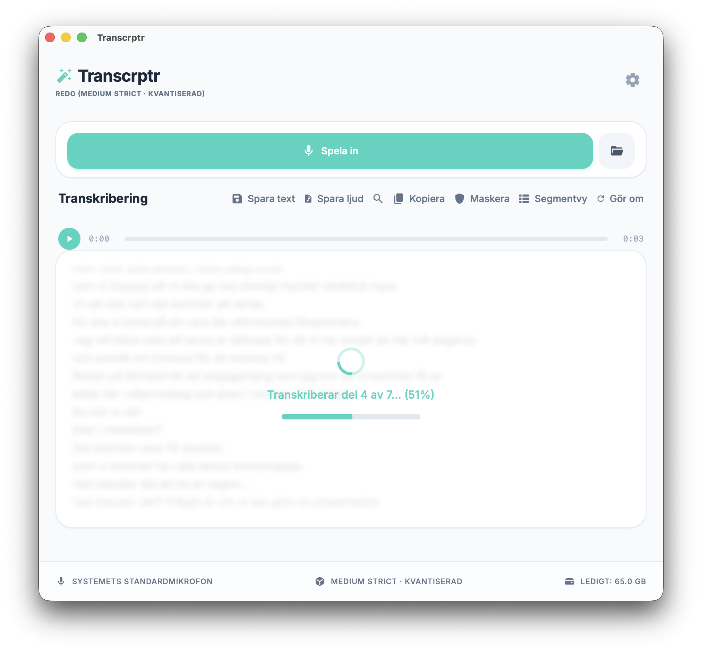

# Transcrptr

Transcrptr är en lokal, integritetsfokuserad skrivbordsapp som omvandlar tal till text — helt utan molntjänster. Allt sker på din egen dator; ditt ljud och din röstdata lämnar aldrig din maskin.



## 🇸🇪 Fokus på svenska

Transcrptr använder [KB-whisper](https://huggingface.co/KBLab/kb-whisper-small) — en AI-modell från **Kungliga biblioteket (KB)** specialtränad på **50 000+ timmar** av svenskt tal, däribland tv-sändningar, riksdagstal och dialekter från hela landet.

> **Andra språk?** Transcrptr kan hantera andra språk tack vare Whisper-arkitekturen, men resultatet blir bäst på svenska.

📰 [Läs mer om KB-whisper på Kungliga bibliotekets hemsida](https://www.kb.se/om-oss/nyheter/nyhetsarkiv/2025-02-20-valtranad-ai-modell-forvandlar-tal-till-text.html)

## ✨ Funktioner
- **🔒 Integritet:** Ditt ljud stannar på din dator. Inget skickas till externa servrar. [Integritetspolicy](PRIVACY.md)
- **⚡ Hårdvaruaccelererad:** Vulkan utnyttjar din GPU för snabbare transkribering.
- **🎙️ Mötesinspelning (Windows):** Spela in både mikrofon och datorljud från t.ex. Teams/Zoom — med Stereo Mix (se guide nedan).
- **⏸️ Pausa inspelning:** Pausa och återuppta. Varje del tidsstämplas automatiskt.
- **🔄 Gör om transkribering:** Byt modell och kör om utan att spela in på nytt.
- **✏️ Redigera transkribering:** Redigera, sök och ersätt direkt i appen (Ctrl+F).
- **📝 Personlig ordlista:** Mata in facktermer och medicinsk terminologi som skickas som ledtrådar till transkriberingsmotorn — förbättrar igenkänning av domänspecifika ord.
- **🛡️ GDPR-maskning:** Maskera personnummer, telefonnummer och e-postadresser automatiskt eller med ett knapptryck — direkt på enheten, ingen data lämnar din dator.
- **🎬 Segmentredigering:** Visa transkriberingen som tidsstämplade rader — klicka på en tidsstämpel för att hoppa direkt till den punkten i inspelningen.
- **🔊 Synkad ljudspelare:** Spela upp inspelningen direkt i appen med automatisk markering av det aktiva textsegmentet.
- **🟡 Konfidensfärgning:** Ord med låg igenkänningssäkerhet markeras med färg i segmentvyn — gul = osäker, röd = mycket osäker. Tröskelvärdet justeras i inställningarna.
- **💾 Spara:** Exportera text som `.txt` eller ljud som `.wav`.
- **📊 Modellhantering:** Se, ladda ner och ta bort modeller i inställningarna.

## 📦 Välj rätt modell

Byt modell via **kugghjulet** (⚙️) i appen. Välj storlek, stil och format — ladda ner flera och byt med ett klick.

### KB-whisper (svenska)

Specialtränad på 50 000+ timmar av svenskt tal — bäst val för svenska inspelningar.

| Modell | Format | Storlek | Hastighet | Kvalitet |
|--------|--------|---------|-----------|----------|
| **Medium** *(rekommenderas)* | Standard | ~1.5 GB | ⚡⚡ | Mycket bra |
| **Medium** *(rekommenderas)* | **q5_0 ✓** | ~900 MB | ⚡⚡ | Mycket bra |
| **Large** | Standard | ~3.0 GB | ⚡ | Bäst |
| **Large** | **q5_0 ✓** | ~2.0 GB | ⚡ | Bäst |

> [!TIP]
> **q5_0 rekommenderas** — 40% mindre filstorlek med i princip identisk kvalitet.

### Whisper Turbo (flerspråkig)

OpenAIs officiella large-v3-turbo-modell från [ggerganov/whisper.cpp](https://huggingface.co/ggerganov/whisper.cpp). Välj Turbo när du transkriberar på flera språk, blandar svenska med facktermer på engelska, eller när hastighet är viktigare än maximal noggrannhet på svenska.

| Modell | Format | Storlek | Hastighet | Språk |
|--------|--------|---------|-----------|-------|
| **Large-v3-Turbo** | q8_0 | ~1.5 GB | ⚡⚡⚡ | 100+ språk |

> [!NOTE]
> KB-whisper slår Turbo på ren svenska. Välj Turbo för blandspråkigt innehåll eller internationella möten.

### Stil (KB-whisper)

| Stil | Passar för | Beskrivning |
|------|-----------|-------------|
| **Standard** *(standard)* | Generellt bruk | Balanserat transkript — bra för de flesta användningsfall |
| **Ordagrann** | Diktering, protokoll | Mer verbalt transkript som följer det talade nära |

> [!NOTE]
> Välj stil i inställningarna innan nedladdning. Varje kombination av storlek + stil är en separat modell. Turbo har ingen stilvariant.

## 🎙️ Spela in möten — WASAPI vs Stereo Mix (Windows)

Det finns två sätt att spela in både mikrofon och datorns systemljud (Teams, Zoom, Spotify m.fl.):

| | **WASAPI** *(inbyggt)* | **Stereo Mix** *(Windows-funktion)* |
|---|---|---|
| **Kräver inställning** | Nej | Ja (engångsinställning) |
| **Pausa inspelning** | Nej | Ja |
| **Välj mikrofon i appen** | Ja | Nej (styrs av Windows) |
| **Systemljud** | Ja | Ja |
| **Drivrutinsstöd** | Beror på ljudkortet | Beror på ljudkortet |

### Alternativ 1: WASAPI (inbyggt, ingen installation)

Aktivera **"Spela in systemljud (WASAPI)"** i inställningarna (⚙️) i appen. Transcrptr spelar in datorns systemljud automatiskt och mixar det med den mikrofon du valt i listan.

> [!NOTE]
> Pause-knappen är inte tillgänglig i WASAPI-läge.

### Alternativ 2: Stereo Mix (rekommenderas för möten)

Stereo Mix är en virtuell Windows-enhet som fångar allt systemljud och mixar det med valfri mikrofon. Kräver en engångsinställning i Windows.

1. **Öppna ljudinställningar:** Högerklicka på ljudikonen i aktivitetsfältet → välj **"Ljudinställningar"**.
2. **Hitta detaljerade steg:** Scrolla längst ner och klicka på **"Mer ljudinställningar"** (viktigt för Windows 11).
3. **Visa enheter:** I fönstret som öppnas, gå till fliken **Inspelning**. Högerklicka på en tom yta och aktivera **"Visa inaktiverade enheter"**.
4. **Aktivera:** Högerklicka på **Stereo Mix** → **Aktivera**.
5. **Sätt som standard:** Högerklicka på **Stereo Mix** igen → **"Ange som standardenhet"**.
6. **Välj i appen:** Välj **"Systemets standardmikrofon"** i mikrofonlistan i Transcrptr.

> [!IMPORTANT]
> Starta alltid mötet och se till att ljud spelas **innan** du trycker Spela in i Transcrptr.

> [!NOTE]
> Syns inte Stereo Mix? Din dators ljudkort saknar stöd för det. Använd WASAPI-alternativet istället.

## 📥 Ladda ner
Gå till [Releases](https://github.com/mrswedish/transcrptr/releases) för senaste versionen:

- **Windows:** Ladda ner `Transcrptr-portable.exe` och kör direkt. Ingen installation krävs.

## 🏗️ Arkitektur
- **Tauri** (Rust-backend, webbfrontend)
- **Whisper.cpp** via `whisper-rs` för C++-optimerad transkribering
- **Vanilla JS + CSS** för ett snabbt gränssnitt

## 🛠️ Bygga från källkod

### Förutsättningar
- [Node.js](https://nodejs.org/) (v20+)
- [Rust](https://www.rust-lang.org/tools/install)
- [CMake](https://cmake.org/)

### Kom igång
```bash
git clone https://github.com/mrswedish/transcrptr.git
cd transcrptr
npm install
npm run tauri dev
```
