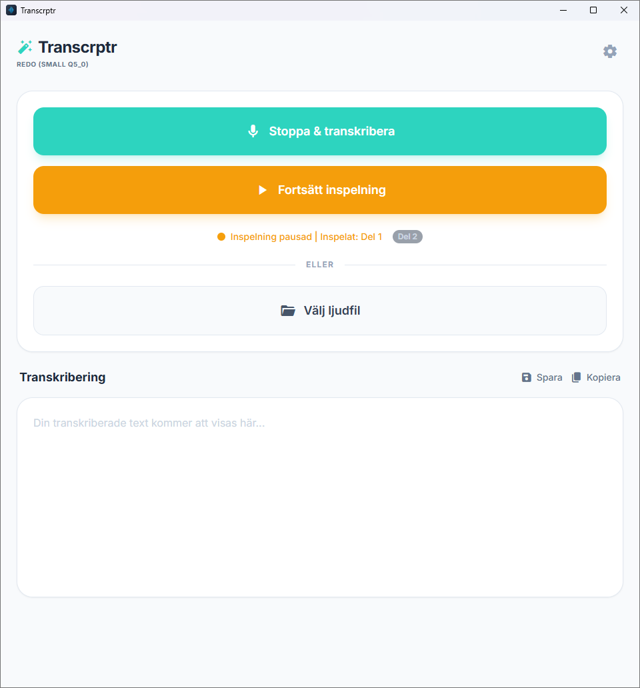

# Transcrptr

Transcrptr är en lokal, integritetsfokuserad skrivbordsapp som omvandlar tal till text — helt utan molntjänster. Allt sker på din egen dator, vilket betyder att ditt ljud och din röstdata aldrig lämnar din maskin.



## 🇸🇪 Fokus på svenska

Transcrptr är byggt med det svenska språket i fokus. Applikationen använder [KB-whisper](https://huggingface.co/KBLab/kb-whisper-small) — en AI-modell från **Kungliga biblioteket (KB)** som är specialtränad på mer än **50 000 timmar** av svenskt tal, däribland tv-sändningar, riksdagstal och dialekter från hela landet.

Tack vare denna träning är modellen ovanligt träffsäker på svenska — den klarar av allt från formella presentationer till vardagligt samtalsspråk och regionala dialekter.

> **Andra språk?** Även om fokus ligger på svenska kan Transcrptr hantera andra språk tack vare den underliggande Whisper-arkitekturen. Resultatet blir dock bäst på svenska.

📰 [Läs mer om KB-whisper på Kungliga bibliotekets hemsida](https://www.kb.se/om-oss/nyheter/nyhetsarkiv/2025-02-20-valtranad-ai-modell-forvandlar-tal-till-text.html)

## ✨ Funktioner
- **🔒 Integritet först:** Ditt ljud stannar på din dator. Inget skickas till externa servrar — din integritet är garanterad. [Läs vår integritetspolicy](PRIVACY.md)
- **⚡ Hårdvaruaccelererad:** Vulkan (Windows) och Metal (macOS) utnyttjar din GPU för snabbare transkribering.
- **🎙️ Mötesinspelning (Windows):** Spela in både din mikrofon och systemljud (WASAPI) från videomöten direkt i appen.
- **⏸️ Pausa inspelning:** Pausa och återuppta inspelningen för kortare avbrott. Varje del tidsstämplas automatiskt.
- **🔄 Gör om transkribering:** Upptäckte du att modellen var för liten? Gör om transkriberingen med en större modell utan att behöva spela in ljudet på nytt.
- **💾 Spara och kopiera:** Exportera transkriberingen som `.txt`-fil eller kopiera direkt till urklipp.
- **📊 Hantering av modeller:** Se vilka modeller du laddat ner, hur mycket plats de tar och radera de du inte använder.
- **🛡️ Mer minne:** Automatiskt uppdelning av stora filer för att undvika minnesbrist.

## 📦 Välj rätt modell

Transcrptr erbjuder tre storlekar av språkmodellen. Du byter modell genom att klicka på **kugghjulet** (⚙️) i appen:

| Modell | Storlek | Hastighet | Kvalitet | Bäst för |
|--------|---------|-----------|---------------|----------|
| **Tiny** | ~75 MB | ⚡⚡⚡⚡ | Grundläggande | Mycket snabba anteckningar |
| **Base** | ~140 MB | ⚡⚡⚡ | Bra | Korta röstmeddelanden |
| **Small** | ~460 MB | ⚡⚡ | Okej | Enkla anteckningar, ensamtal |
| **Medium** | ~1.5 GB | ⚡ | Mycket bra | Föreläsningar, intervjuer |
| **Large v3 Turbo** | ~1.6 GB | ⚡ | Utmärkt | Möten, professionella sammanhang |
| **Large v3** | ~3.0 GB | 🐢 | Bäst | Svåra dialekter, brusigt ljud |

> [!WARNING]
> **Small-modellen** rekommenderas inte för möten eller samtal med flera deltagare. Kvaliteten på transkriberingen blir ofta för låg för att vara användbar i professionella sammanhang. För möten rekommenderas minst **Medium** eller **Large v3 Turbo**.

> **Tips:** Om resultatet inte blir tillräckligt bra, prova en större modell. Skillnaden i kvalitet är markant mellan t.ex. Small och Large.

## 📥 Ladda ner
Gå till [Releases](https://github.com/mrswedish/transcrptr/releases) för att hämta senaste versionen:

- **Windows:** Ladda ner `Transcrptr-portable.exe` och kör direkt. Ingen installation krävs.
- **macOS:** Ladda ner `.dmg` eller `.app` från release-sidan. *(macOS kan visa en varning vid första start — se felsökning nedan).*

## 🏗️ Arkitektur
- **Tauri** (Rust-backend, webbfrontend)
- **Whisper.cpp** via `whisper-rs` för C++-optimerad transkribering
- **Vanilla JS + CSS** för ett snabbt och snyggt gränssnitt

## 🛠️ Bygga från källkod

### Förutsättningar
- [Node.js](https://nodejs.org/) (v20+)
- [Rust](https://www.rust-lang.org/tools/install)
- [CMake](https://cmake.org/)

### Kom igång
```bash
# Klona repot
git clone https://github.com/mrswedish/transcrptr.git
cd transcrptr

# Installera frontend-beroenden
npm install

# Kör i utvecklingsläge
npm run tauri dev

# Bygg för produktion
npm run tauri build
```

## ❓ Felsökning

### macOS: "Transcrptr.app är skadad och kan inte öppnas"

Eftersom Transcrptr distribueras utan en officiell Apple Developer-signatur lägger macOS Gatekeeper en karantänflagga på appen vid nedladdning. macOS varnar felaktigt att appen är "skadad".

**Appen är inte skadad.**

Lösning:
1. Flytta `Transcrptr.app` till mappen `Program`.
2. Öppna **Terminal**.
3. Kör:
   ```bash
   xattr -cr /Applications/Transcrptr.app
   ```
4. Nu kan du öppna Transcrptr som vanligt!
